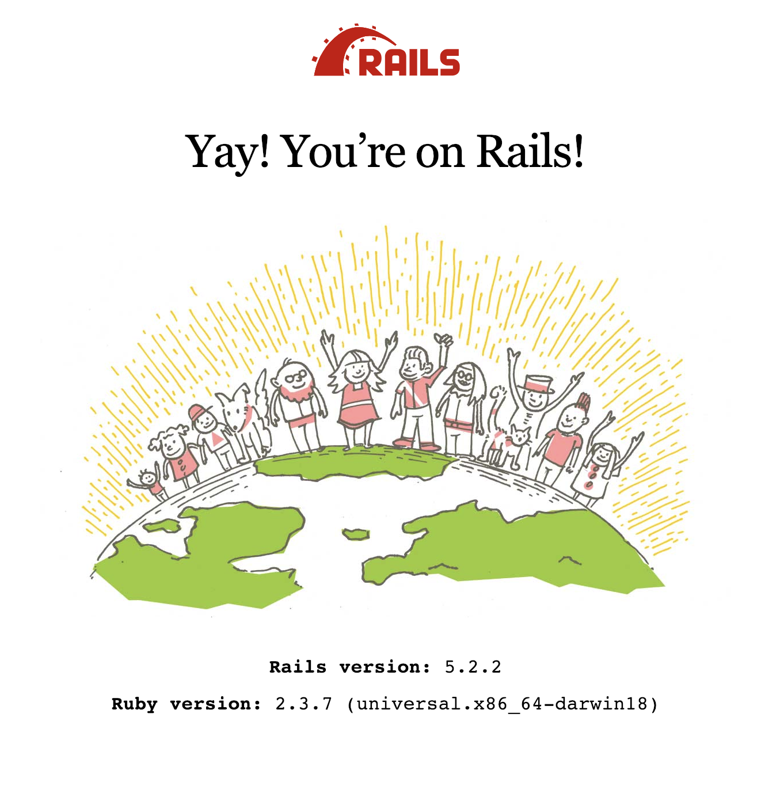

# Shopify Challenge 2019

## Problem Requirements 

Every product should have a title, price, and inventory_count.

Querying for all products should support passing an argument to only return products with available inventory. 

Products should be able to be "purchased" which should reduce the inventory by 1. Products with no inventory cannot be purchased.

**Extra Credit** 

Fit these product purchases into the context of a simple shopping cart. 

That means purchasing a product requires first creating a cart, adding products to the cart, and then "completing" the cart.
The cart should contain a list of all included products, a total dollar amount (the total value of all products), and product inventory shouldn't reduce until after a cart has been completed.

**Extra Extra Credit**

Bonus points for making your API (at least partly) secure, writing documentation that doesn’t suck, including unit tests, and/or building your API using GraphQL.

## Context
This is a simple shop where you can purchase varied goods using API call. In this shop you can buy any Memes intellectual property you want at a low starting cost of 0.99$.

The products we are see are selling in this shop are memes and they have a title, price ,and a number of inventory so we can track how much we have in stock

The order is what the Cart has as you can buy mutiple of the same memes in a cart transaction this will be what keep track of the product, how much of it you have and what cart it is stored in

The cart is where the orders lie an when purchased all the order are filled and then the cart is marked as completed and the products inventory count will update

## Schema 

**Product**
  - Title (String)
  - Price (Float)
  - Inventory Count (Int)

**LineItem**
  - Amount (Int)
  - Product
  - Cart

**Cart**
  - Value (Int)
  - LineItems 

## Get Started 
Before cloning the repo make sure you have [ruby](https://www.ruby-lang.org/en/) and [rails](https://weblog.rubyonrails.org/2018/12/4/Rails-5-2-2-has-been-released/) installed on your machine

- run `rails s` or `rails server`
- Go to `localhost:3000` and you should see 

- Congrats!  this means that the project was properly installed now go to `http://localhost:3000/graphiql` in order to see the GraphQL interface

- Now you should be able to use all the given endpoints in order to make transactions the my MEME shop

## Documentation 

[back to top](#shopify-challenge-2019)

