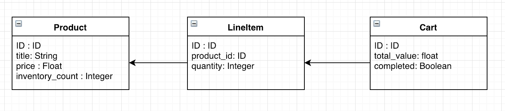
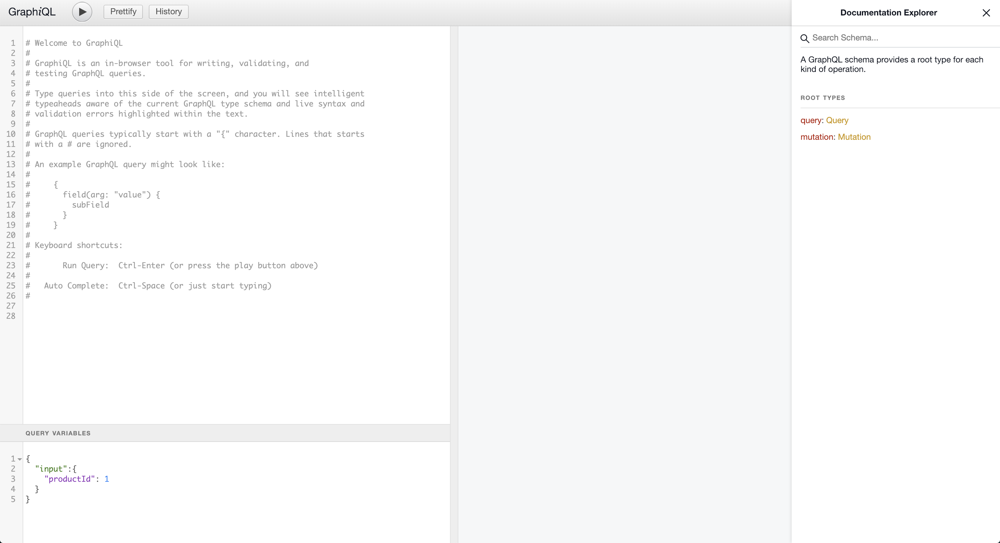
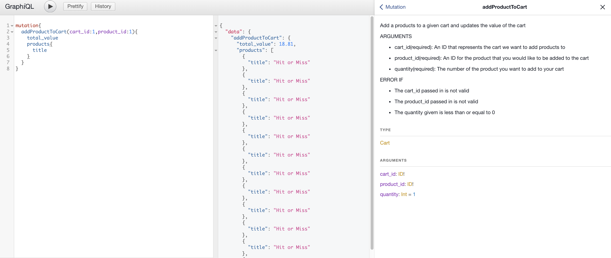

# Shopify Challenge 2019
## Table of Contents
- [Problem Requirements](#problem-requirements)
- [Context](#context)
- [Schema](#schema)
- [Getting Started](#getting-started)
- [Security](#security)
- [Operations](#operations)
  - [Queries](#queries)
  - [Mutations](#mutations)
- [Extended Functionality](#extended-functionality)
- [Documentation](#documentation)

## Problem Requirements 

Every product should have a title, price, and inventory_count.

Querying for all products should support passing an argument to only return products with available inventory. 

Products should be able to be "purchased" which should reduce the inventory by 1. Products with no inventory cannot be purchased.

**Extra Credit** 

Fit these product purchases into the context of a simple shopping cart. 

That means purchasing a product requires first creating a cart, adding products to the cart, and then "completing" the cart.
The cart should contain a list of all included products, a total dollar amount (the total value of all products), and product inventory shouldn't reduce until after a cart has been completed.

**Extra Extra Credit**

Bonus points for making your API (at least partly) secure, writing documentation that doesn’t suck, including unit tests, and/or building your API using GraphQL.  
[back to top](#shopify-challenge-2019)

## Context
This is a simple shop where you can purchase varied goods using API call. In this shop you can buy any Memes intellectual property you want at a low starting cost of 0.99$.  

  
**An example of the Memes you can buy**

The products we are see are selling in this shop are memes and they have a title, price ,and a number of inventory so we can track how much we have in stock

The order is what the Cart has as you can buy mutiple of the same memes in a cart transaction this will be what keep track of the product, how much of it you have and what cart it is stored in

The cart is where the orders lie an when purchased all the order are filled and then the cart is marked as completed and the products inventory count will update  
[back to top](#shopify-challenge-2019)

## Schema 

**Product**
  - Title (String)
  - Price (Float)
  - Inventory Count (Int)

**LineItem**
  - Amount (Int)
  - Product
  - Cart

**Cart**
  - Value (Int)
  - LineItems 

  
[back to top](#shopify-challenge-2019)


## Geting Started 
Before cloning the repo make sure you have [ruby](https://www.ruby-lang.org/en/) and [rails](https://weblog.rubyonrails.org/2018/12/4/Rails-5-2-2-has-been-released/) installed on your machine

- run `bundle` to install all ruby gems related to the project
- run `rake db:migrate` and `rake db:seed` to migrate the database and seed it with data
- run `rails s` or `rails server`
- Go to `localhost:3000` and you should see 

- Congrats!  this means that the project was properly installed now go to `http://localhost:3000/graphiql` in order to see the GraphQL interface

- Now you should be able to use all the given endpoints in order to make transactions the my MEME shop  
[back to top](#shopify-challenge-2019)

## Operations 
This is a list of all operations that can be done to the products. It supports all CRUD operation (Create,Read,Update,Delete) in order to have a proper store setup  
[back to top](#shopify-challenge-2019)

### Queries
**allProduct:s**
A query that retrieves all products in the database. Can accept a boolean that if set to true returns all the products with an available inventort

**getProduct:**
A query that returns the specified product based on the ID sent to the query. Will error if the ID is invalid

**getCart:**
A query that returns the cart of the ID that was sent to the query. Will error if the ID is invalid  
[back to top](#shopify-challenge-2019)

### Mutations
**purchaseProduct:**
A mutation that purchases 1 of the product from the product_id inputed

**addProductToCart:**
A mutation that adds a product to the cart given and also updates the price of the cart

**createCart:**
A mutation that creates a new instance of the product in the database

**createProduct:**
A mutation that creates a new product

**purchaseCart:**
A mutation that purchases all the products in the cart

**increaseInventory:**
A mutation that adds more inventory to the given product based on the number given

**updateProductTitle:**
A mutation that changes the products title

**removeCart:**
A mutation that removes all the instances of the given cart

**removeProduct:**
A mutation that remove all instaces of the given product  
[back to top](#shopify-challenge-2019)

## Security 
All of the end points have **error handling** that lets the user know why their call has failed. This error handling is dealt with using GraphQl's execution errors  

Example of error handling
```
{
  "data": {
    "getProduct": null
  },
  "errors": [
    {
      "message": "The product id doesn't exist",
      "locations": [
        {
          "line": 2,
          "column": 3
        }
      ],
      "path": [
        "getProduct"
      ]
    }
  ]
}
```  
[back to top](#shopify-challenge-2019)
## Documentation 
  In order to achieve somewhat decent documentation these steps were taken
  1. **Inline Documentation** Everything in this project that is fairly complicated has been documented with inline code comments
  2. **README** The README has been created with the intent on helping users set-up the api and understand the API relatively easy
  3. **GraphIQL** The GraphIQL interface has been all documented for each endpoint


**Example of Documentation found in GraphIQL**
  
[back to top](#shopify-challenge-2019)


